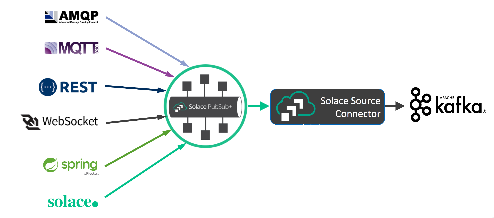
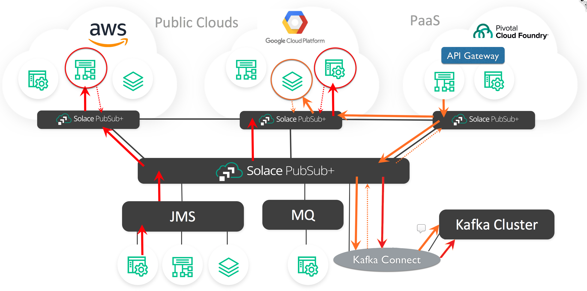
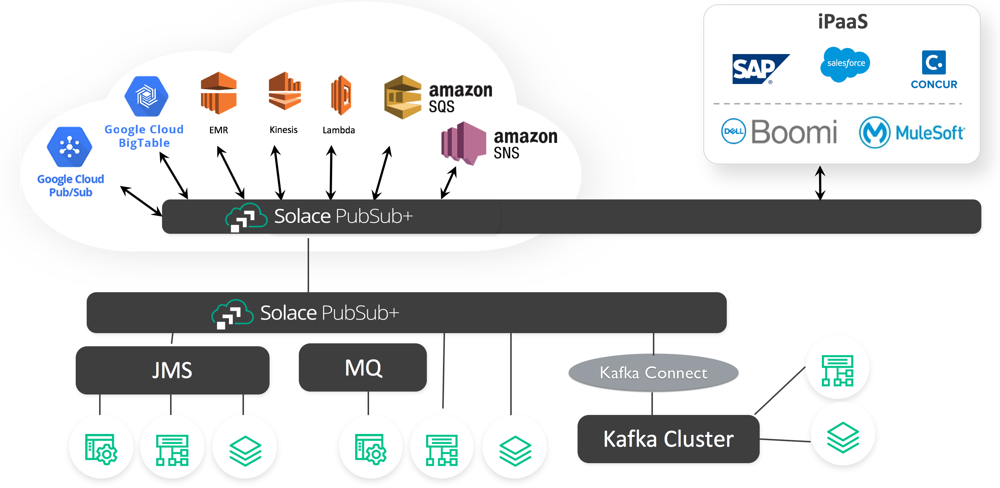

[](https://travis-ci.org/SolaceDev/pubsubplus-connector-kafka-source)

# PubSub+ Connector Kafka Source

This project provides a Solace PubSub+ Event Broker to Kafka [Source Connector](//kafka.apache.org/documentation.html#connect_concepts) (adapter) that makes use of the [Kafka Connect API](//kafka.apache.org/documentation/#connect).

> Note: there is also a PubSub+ Kafka Sink Connector available from the [PubSub+ Connector Kafka Sink]() GitHub repository.

Contents:

  * [Overview](#overview)
  * [Use Cases](#use-cases)
  * [Downloads](#downloads)
  * [Quick Start](#quick-start)
  * [Parameters](#parameters)
  * [User Guide](#user-guide)
    + [Deployment](#deployment)
    + [Troubleshooting](#troubleshooting)
    + [Message processors](#message-processors)
    + [Performance considerations](#performance-considerations)
    + [Security Considerations](#security-considerations)  
  * [Developers Guide](#developers-guide)

## Overview

The PubSub+ Source Connector consumes PubSub+ event broker real-time queue or topic data events and streams them to a Kafka topic as Source Records. 

The connector was created using PubSub+ high performance Java API to move PubSub+ data events to the Kafka Broker.

## Use Cases

#### Protocol and API messaging transformations

Unlike many other message brokers, the Solace PubSub+ Event Broker supports transparent protocol and API messaging transformations.

As the following diagram shows, any message that reaches the PubSub+ broker via the many supported message transports or language/API - examples can include an iPhone (via C API), a REST POST, an AMQP, JMS or MQTT message - can be moved to a Topic (Key or not Keyed) on the Kafka broker via the single PubSub+ Source Connector.



#### Tying Kafka into the PubSub+ Event Mesh

The [PubSub+ Event Mesh](//docs.solace.com/Solace-PubSub-Platform.htm#PubSub-mesh) is a clustered group of PubSub+ Event Brokers, which appears to individual services (consumers or producers of data events) to be a single transparent event broker and it routes data events in real-time to any service that is part of the Event Mesh. The Solace PubSub+ brokers can be any of the three categories: dedicated extreme performance hardware appliances, high performance software brokers that are deployed as software images (deployable under most Hypervisors, Cloud IaaS and PaaS layers and in Docker) or provided as a fully managed Cloud MaaS (Messaging as a Service). 

Simply by having the PubSub+ Source Connector register interest in receiving events, the entire Event Mesh becomes aware of the registration request and will know how to securely route the appropriate events generated by other service on the Event Mesh to the PubSub+ Source Connector. The PubSub+ Source Connector takes those event  messages and sends them as Kafka Source Records to the Kafka broker for storage in a Kafka Topic, regardless where in the Service Mesh the service is located that generated the event.



#### Eliminating the need of separate Source Connectors

The PubSub+ Source Connector eliminates the complexity and overhead of maintaining separate Source Connectors for each and every upstream service that generates data events that Kafka may wish to consume. There is the added benefit of access to services where there is no Kafka Source Connector available, thereby eliminating the need to create and maintain a new connector for services from which Kafka may wish to store the data.



## Downloads

ZIP or TAR packaged PubSub+ Kafka source connector is available from the [downloads](//solacedev.github.io/pubsubplus-connector-kafka-source/downloads/) page.

The package includes jar libraries, documentation with license information and sample property files. Download and expand it into a directory that is on the `plugin.path` of your connect-standalone or connect-distributed properties file.

## Quick Start

This example demonstrates an end-to-end scenario similar to the [Protocol and API messaging transformations](#protocol-and-api-messaging-transformations) use case, using the WebSocket API to publish a message to the PubSub+ event broker.

It builds on the open source [Apache Kafka Quickstart tutorial](https://kafka.apache.org/quickstart) and will walk through how to get started in a standalone environment for development purposes. For setting up a distributed environment for production purposes refer to the User Guide section.

> Note: the steps are similar if using [Confluent Kafka](//www.confluent.io/download/); there may be difference in the root directory where the Kafka binaries (`bin`) and properties (`etc/kafka`) are located.

**Step 1**: Install Kafka. Follow the [Apache tutorial](//kafka.apache.org/quickstart#quickstart_download) to download the Kafka release code, start the Zookeeper and Kafka servers in separate command line sessions, then create a topic named `test` and verify it exists.

**Step 2**: Install PubSub+ Source Connector. Designate and create a directory for the PubSub+ Source Connector - assuming it is named `connectors`. Edit `config/connect-standalone.properties` and ensure the `plugin.path` parameter value includes the absolute path of the `connectors` directory.
[Download]( https://solacedev.github.io/pubsubplus-connector-kafka-source/downloads ) and expand the PubSub+ Source Connector into the `connectors` directory.

**Step 3**: Acquire access to a PubSub+ message broker. If you don't already have one available, the easiest option is to get a free-tier service in a few minutes in [PubSub+ Cloud](//solace.com/try-it-now/) , following the [Creating Your First Messaging Service] (https://docs.solace.com/Solace-Cloud/ggs_signup.htm) guide. 

**Step 4**: Configure the PubSub+ Source Connector:

a) Locate the following connection information of your messaging service for the "Solace Java API" (this is what the connector is using inside):
* Username, Password, Message VPN, one of the Host URIs;

b) edit the PubSub+ Source Connector properties file located at `connectors/pubsubplus-connector-kafka-source-<version>/etc/solace_source.properties`  updating following respective parameters so the connector can access the PubSub+ event broker:
* `sol.username`, `sol.password`, `sol.vpn_name`, `sol.host`;

c) Note the configured source and destination information: the `sol.topics` parameter specifies the ingress topic on PubSub+ (`sourcetest`) and `kafka.topic` is the Kafka destination topic (`test`), created in Step 1.

**Step 5**: Start the connector in standalone mode. In a command line session run:
```sh
bin/connect-standalone.sh \
config/connect-standalone.properties \
connectors/pubsubplus-connector-kafka-source-<version>/etc/solace_source.properties
```
After startup, logs shall eventually contain following line:
```
================Session is Connected
```

**Step 6**: Start to watch messages arriving to Kafka. Get back to the Kafka [tutorial](//kafka.apache.org/quickstart#quickstart_consume) and start a consumer on the `test` topic.

**Step 7**: Demo time!
To generate an event into PubSub+, we will use the "Try Me!" test service of the browser-based administration console to publish test messages to the `sourcetest` topic. Behind the scenes, "Try Me!" is using the WebSocket API from JavaScript code.

* If you are using PubSub+ Cloud for your messaging service follow the [Trying Out Your Messaging Service guide](//docs.solace.com/Solace-Cloud/ggs_tryme.htm).

* If using an existing event broker, log in to its [PubSub+ Manager admin console](//docs.solace.com/Solace-PubSub-Manager/PubSub-Manager-Overview.htm#mc-main-content) and follow the [How to Send and Receive Test Messages guide](//docs.solace.com/Solace-PubSub-Manager/PubSub-Manager-Overview.htm#Test-Messages).

In both cases ensure to set the topic to `sourcetest`, which the connector is listening to.

The Kafka consumer from Step 6 should now display the new message arriving to Kafka through the PubSub+ Kafka source connector:
```
Hello world!
```

## Parameters

Connector parameters consist of [Kafka-defined parameters](https://kafka.apache.org/documentation/#connect_configuring) and PubSub+ connector-specific parameters.

Refer to the in-line documentation of the [sample PubSub+ Kafka source connector properties file](/etc/solace_source.properties) and additional information in the [Configuration](#Configuration) section.

## User Guide

### Deployment

The PubSub+ Source Connector deployment has been tested on Apache Kafka 2.12 and Confluent Kafka 5.4 platforms. The Kafka software is typically placed under the root directory: `/opt/<provider>/<kafka or confluent-version>`.

Kafka distributions may be available as install bundles, Docker images, Kubernetes deployments, etc. They all support Kafka Connect which includes the scripts, tools and sample properties for Kafka connectors.

Kafka provides two options for connector deployment: [standalone mode and distributed mode](//kafka.apache.org/documentation/#connect_running).

* In standalone mode, recommended for testing only, configuration is provided together in the Kafka `connect-standalone.properties` and in the PubSub+ Source Connector `solace_source.properties` files and passed to the `connect-standalone` Kafka shell script running on a single worker node (machine), as seen in the [Quick Start](#quick-start).

* In distributed mode, Kafka configuration is provided in `connect-distributed.properties` and passed to the `connect-distributed` Kafka shell script, which is started on each worker node. The `group.id` parameter identifies worker nodes belonging the same group. The script starts a REST server on each worker node and PubSub+ Source Connector configuration is passed to any one of the worker nodes in the group through REST requests in JSON format.

To deploy the Connector, for each target machine [download]( https://solacedev.github.io/pubsubplus-connector-kafka-source/downloads ), and expand the PubSub+ Source Connector into a directory and ensure the `plugin.path` parameter value in the `connect-*.properties` includes the absolute path to that directory. Note that Kafka Connect, i.e. the `connect-standalone` or `connect-distributed` Kafka shell scripts must be restarted or equivalent action from a Kafka console is required if the PubSub+ Source Connector deployment is updated.

Some PubSub+ Source Connector configurations may require the deployment of additional specific files like keystores, truststores, Kerberos config files, etc. It does not matter where these additional files are located, but they must be available on all Kafka Connect Cluster nodes and placed in the same location on all the nodes because they are referenced by absolute location and configured only once through one REST request for all.

#### REST JSON Configuration

First test to confirm the PubSub+ Source Connector is available for use in distributed mode with the command:
```ini
curl http://18.218.82.209:8083/connector-plugins | jq
```

In this case the IP address is one of the nodes running the distributed mode worker process, the port is default 8083 or as specified in the `rest.port` property in `connect-distributed.properties`. If the connector is loaded correctly, you should see something similar to:

```
[
  {
    "class": "com.solace.source.connector.SolaceSourceConnector",
    "type": "source",
    "version": "2.0.0"
  },
```

At this point, it is now possible to start the connector in distributed mode with a command similar to:

```ini
curl -X POST -H "Content-Type: application/json" \
             -d @solace_source_properties.json \
             http://18.218.82.209:8083/connectors
``` 

The connector's JSON configuration file, in this case, is called "solace_source_properties.json". A sample is available [here](/etc/solace_source_properties.json), which can be extended with the same properties as described in the [Parameters section](#parameters).

Determine if the Source Connector is running with the following command:
```ini
curl 18.218.82.209:8083/connectors/solaceSourceConnector/status | jq
```
If there was an error in starting, the details will be returned with this command. 

### Troubleshooting

In standalone mode, connect logs are written to the console. If you do not want the output to console, simply add the "-daemon" option and all output will be directed to the logs directory.

In distributed mode, the logs location is determined by the `connect-log4j.properties` located at the `config` directory in the Apache Kafka distribution or under `etc/kafka/` in the Confluent distribution.

If logs are redirected to the standard output, here is a sample log4j.properties snippet to direct them to a file:
```
log4j.rootLogger=INFO, file
log4j.appender.file=org.apache.log4j.RollingFileAppender
log4j.appender.file.File=/var/log/kafka/connect.log
log4j.appender.file.layout=org.apache.log4j.PatternLayout
log4j.appender.file.layout.ConversionPattern=[%d] %p %m (%c:%L)%n
log4j.appender.file.MaxFileSize=10MB
log4j.appender.file.MaxBackupIndex=5
log4j.appender.file.append=true
```

To troubleshoot PubSub+ connection issues, increase logging level to DEBUG by adding following line:
```
log4j.logger.com.solacesystems.jcsmp=DEBUG
```
Ensure to set it back to INFO or WARN for production.

### Message processors

### Performance considerations

### Security Considerations

## Developers Guide

### Build the project


## Contributing

Please read [CONTRIBUTING.md](CONTRIBUTING.md) for details on our code of conduct, and the process for submitting pull requests to us.

## Authors

See the list of [contributors](../../graphs/contributors) who participated in this project.

## License

This project is licensed under the Apache License, Version 2.0. - See the [LICENSE](LICENSE) file for details.

## Resources

For more information about Solace technology in general please visit these resources:

- The [Solace Developers website](https://www.solace.dev/)
- Understanding [Solace technology]( https://solace.com/products/tech/)
- Ask the [Solace Community]( https://solace.community/)
